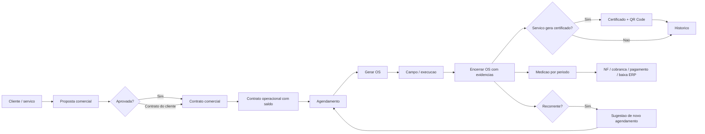

# Mapa do produto

## Objetivo do produto

Atenza FieldOps e uma plataforma SaaS multi-tenant para gestao de servicos tecnicos de campo. O objetivo e ligar o ciclo comercial ao operacional e ao acompanhamento de medicao: proposta, contrato, saldo, agendamento, equipe, OS, evidencias, certificados, historico, medicao e recorrencia.

## Publico-alvo

- Empresas prestadoras de servicos tecnicos recorrentes.
- Times comerciais que emitem propostas e contratos.
- Times operacionais que programam visitas, equipes e veiculos.
- Equipes de campo que executam OS e retornam evidencias.
- Responsaveis tecnicos/qualidade que validam certificados e anexos.
- Administrativo/financeiro operacional que gera medicoes e acompanha NF/pagamento ate baixa no ERP.
- Atenza como operadora SaaS.

## Limite entre plataforma e tenant

| Area | Plataforma Atenza | Tenant cliente |
| --- | --- | --- |
| Nome do sistema | Atenza FieldOps | Nome fantasia do cliente apenas dentro do ambiente |
| Favicon global | Atenza | Somente em dominio white-label se decidido |
| Login padrao | Institucional Atenza | Pode exibir "Ambiente [cliente]" discretamente quando tenant vier da URL |
| Sidebar autenticada | Produto Atenza + modulo | Logo e cores do tenant |
| Documentos | Motor, template, versionamento | Logo, dados, assinatura, cores e textos parametrizados |
| Suporte/operacao | Atenza | Administrador do tenant |
| Planos/pagamento | Atenza | Status do tenant/assinatura |

## Modulos atuais

| Modulo | Rotas principais | Observacao de auditoria |
| --- | --- | --- |
| Acesso | `/login`, `/alterar-senha` | Login interno funciona, mas ainda precisa politica visual/recuperacao por e-mail. |
| Dashboard | `/` | Deve ser item independente, nao dentro de "Inicio". |
| Comercial | `/comercial/clientes`, `/comercial/servicos`, `/comercial/contratos` | Fluxo faz sentido, mas precisa separar melhor proposta, contrato e contrato do cliente. |
| Configuracoes do tenant | `/comercial/configuracoes` | Esta em Comercial, mas deveria ser Administracao/Configuracoes. |
| Operacional | `/agendar`, `/ordens`, `/certificados`, `/equipes`, `/auditoria-anexos` | Precisa separar cadastro de equipe, planejamento e auditoria. |
| Financeiro operacional | `/medicao` | Escopo correto: medicao e acompanhamento ate ERP, sem contas a receber formal. |
| Administracao | `/usuarios`, `/auditoria-eventos` | Base existe, mas falta gestao granular madura e painel Atenza global. |
| Publico | `/validar-certificado/:hash` | Validacao publica existe e deve ser mantida independente de login. |

## Entidades principais

- Tenant.
- Usuario.
- Perfil.
- Permissao.
- Cliente.
- Contato.
- Local de execucao.
- Equipamento/tag.
- Servico/produto.
- POP.
- Proposta/contrato comercial.
- Contrato operacional/saldo.
- Agendamento.
- Tecnico.
- Veiculo.
- Ordem de servico.
- Evidencia/anexo.
- Certificado.
- Medicao.
- Item de medicao.
- Sugestao de recorrencia.
- Audit log.

## Fluxo real reconstruido

## Diferenca entre documentado e implementado

| Tema | Documentado | Implementado | Status |
| --- | --- | --- | --- |
| Proposta -> contrato -> operacional | Previsto | Implementado no escopo base | Parcialmente pronto |
| Saldo operacional | Previsto | Agenda lista contratos com saldo | Precisa teste de borda/cancelamento |
| OS com evidencia e fotos | Previsto | Implementado, ate 3 fotos em certificado | Parcialmente pronto |
| Certificado antifraude | Previsto | Hash e QR Code existem | Falta snapshot imutavel final/PDF server-side |
| Medicao | Previsto | Implementada com acompanhamento financeiro operacional | Precisa teste de duplicidade e status |
| Recorrencia | Previsto | Sugestoes existem | Precisa UX e validacao E2E |
| Multi-tenant SaaS | Previsto | Base parcial | Nao pronto para producao |
| Gestao Atenza SaaS | Previsto como backlog | Nao implementado | Pendente |

